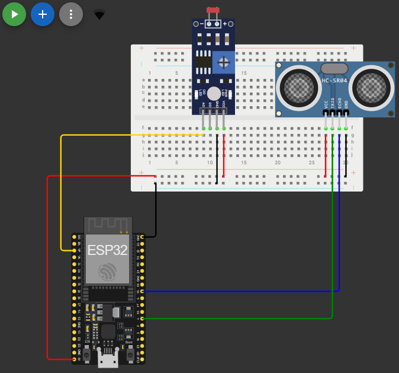
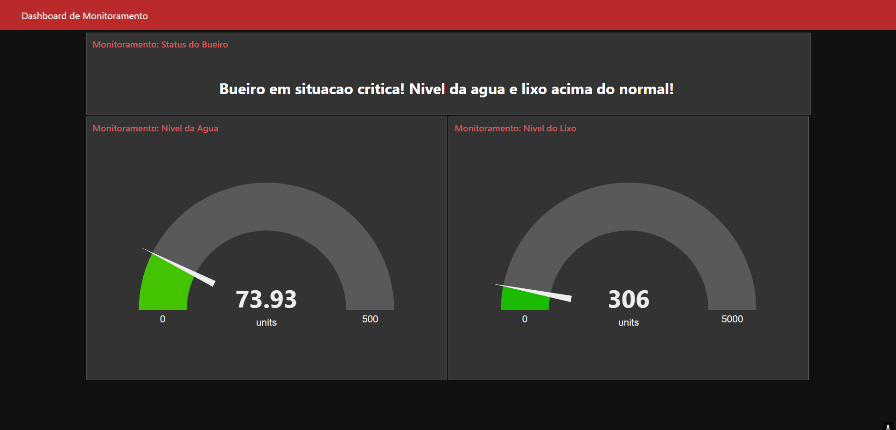

# Global Solution - Edge Computing & IoT
Solucao da Global Solution 2 semestre realizada por:
- Pedro Henrique Batista Bergamin, 559443
- Ícaro de Oliveira Santos, 559950

Este projeto visa reduzir o numero de enchentes e alagamentos previnindo bueiros de alagarem/entupirem fazendo a deteccao da quantidade de lixo/corpos estranhos e do nivel da agua presente no bueiro.

## Video:
Video demonstracao da Global Solution

[Youtube](https://youtu.be/BWQ322RRqx8)

## Componentes
Lista de componentes usados no projeto

- 1x ESP-32
- 1x Board
- 9x Fios 
- 1x Sensor LDR
- 1x Sensor ultrassonico (HC-SR04)

## Como rodar
Acesse o link abaixo:

[Projeto WokiWi](https://wokwi.com/projects/432790418776832001)

Verifique se as bibliotecas abaixo estao instaladas
- WiFi
- PubSubClient

Instale o [Node.js](https://nodejs.org/pt)

Instale o Node-Red atraves do comando:

```JSON
npm i -g node-red
```

Inicie um servidor no Node-Red com:

```JSON
node-red
```

Acesse o link: http://127.0.0.1:1880/ e faca o import dos [flows](./flows.json)
> Atencao, a porta pode mudar, por isso acesse o link fornecido no terminal apos iniciar o node-red

Acesse a dashboard atraves do link: http://127.0.0.1:1880/ui
> Atencao, a porta pode mudar, por isso acesse o link fornecido no terminal apos iniciar o node-red

## Referencias
Principais referencias utilizadas para realizacao do projeto

[Conexao Esp32 - Node-red](https://www.youtube.com/watch?v=fbQRF_IKuo4)

## Fotos do Projeto:



